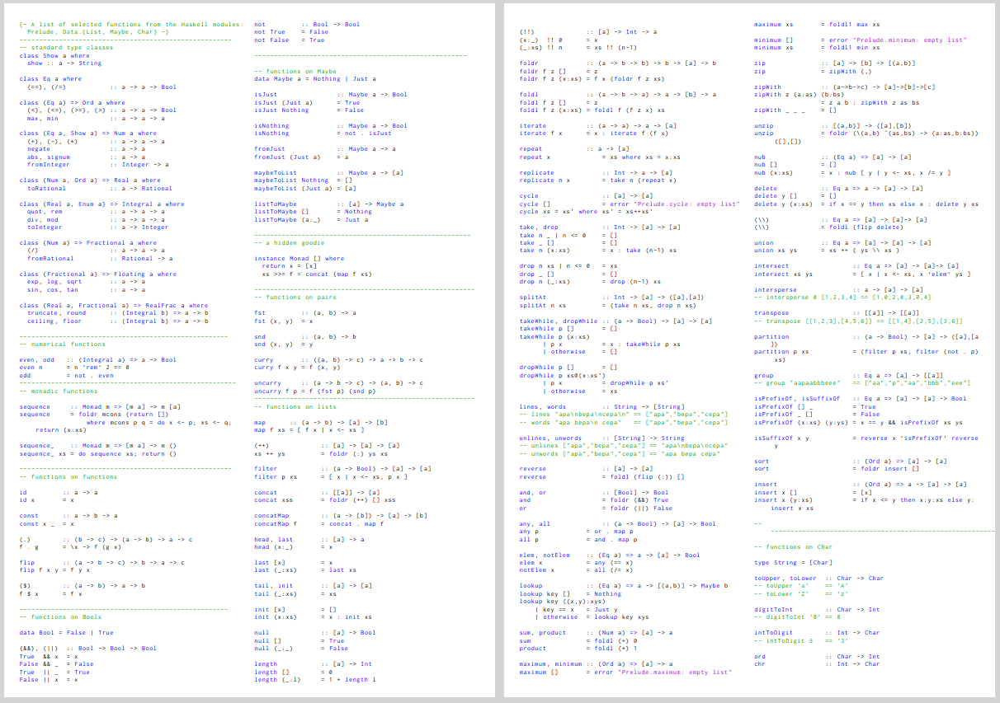

<!--
author:   Andrea Charão

email:    andrea@inf.ufsm.br

version:  0.0.1

language: PT-BR

narrator: Brazilian Portuguese Female

comment:  Material de apoio para a disciplina
          ELC117 - Paradigmas de Programação
          da Universidade Federal de Santa Maria

translation: English  translations/English.md

link:     custom.css


link:     https://cdn.jsdelivr.net/chartist.js/latest/chartist.min.css

script:   https://cdn.jsdelivr.net/chartist.js/latest/chartist.min.js

@onload
window.CodeRunner = {
    ws: undefined,
    handler: {},
    connected: false,
    error: "",
    url: "",
    firstConnection: true,

    init(url, step = 0) {
        this.url = url
        if (step  >= 10) {
           console.warn("could not establish connection")
           this.error = "could not establish connection to => " + url
           return
        }

        this.ws = new WebSocket(url);

        const self = this
        
        const connectionTimeout = setTimeout(() => {
          self.ws.close();
          console.log("WebSocket connection timed out");
        }, 5000);
        
        
        this.ws.onopen = function () {
            clearTimeout(connectionTimeout);
            self.log("connections established");

            self.connected = true
            
            setInterval(function() {
                self.ws.send("ping")
            }, 15000);
        }
        this.ws.onmessage = function (e) {
            // e.data contains received string.

            let data
            try {
                data = JSON.parse(e.data)
            } catch (e) {
                self.warn("received message could not be handled =>", e.data)
            }
            if (data) {
                self.handler[data.uid](data)
            }
        }
        this.ws.onclose = function () {
            clearTimeout(connectionTimeout);
            self.connected = false
            self.warn("connection closed ... reconnecting")

            setTimeout(function(){
                console.warn("....", step+1)
                self.init(url, step+1)
            }, 1000)
        }
        this.ws.onerror = function (e) {
            clearTimeout(connectionTimeout);
            self.warn("an error has occurred")
        }
    },
    log(...args) {
        window.console.log("CodeRunner:", ...args)
    },
    warn(...args) {
        window.console.warn("CodeRunner:", ...args)
    },
    handle(uid, callback) {
        this.handler[uid] = callback
    },
    send(uid, message, sender=null, restart=false) {
        const self = this
        if (this.connected) {
          message.uid = uid
          this.ws.send(JSON.stringify(message))
        } else if (this.error) {

          if(restart) {
            sender.lia("LIA: terminal")
            this.error = ""
            this.init(this.url)
            setTimeout(function() {
              self.send(uid, message, sender, false)
            }, 2000)

          } else {
            //sender.lia("LIA: wait")
            setTimeout(() => {
              sender.lia(" " + this.error)
              sender.lia(" Maybe reloading fixes the problem ...")
              sender.lia("LIA: stop")
            }, 800)
          }
        } else {
          setTimeout(function() {
            self.send(uid, message, sender, false)
          }, 2000)
          
          if (sender) {
            
            sender.lia("LIA: terminal")
            if (this.firstConnection) {
              this.firstConnection = false
              setTimeout(() => { 
                sender.log("stream", "", [" Waking up execution server ...\n", "This may take up to 30 seconds ...\n", "Please be patient ...\n"])
              }, 100)
            } else {
              sender.log("stream", "", ".")
            }
            sender.lia("LIA: terminal")
          }
        }
    }
}

//window.CodeRunner.init("wss://coderunner.informatik.tu-freiberg.de/")
//window.CodeRunner.init("ws://localhost:4000/")
window.CodeRunner.init("wss://ancient-hollows-41316.herokuapp.com/")
@end

@LIA.c:                 @LIA.eval(`["main.c"]`, `gcc -Wall main.c -o a.out`, `./a.out`)
@LIA.haskell:           @LIA.eval(`["main.hs"]`, `ghc main.hs -o main`, `./main`)
@LIA.haskell_withShell: @LIA.eval(`["main.hs"]`, `none`, `ghci main.hs`)


@LIA.eval:  @LIA.eval_(false,`@0`,@1,@2,@3)

@LIA.evalWithDebug: @LIA.eval_(true,`@0`,@1,@2,@3)

@LIA.eval_
<script>
function random(len=16) {
    let chars = 'ABCDEFGHIJKLMNOPQRSTUVWXYZabcdefghijklmnopqrstuvwxyz0123456789';
    let str = '';
    for (let i = 0; i < len; i++) {
        str += chars.charAt(Math.floor(Math.random() * chars.length));
    }
    return str;
}


const uid = random()
var order = @1
var files = []

var pattern = "@4".trim()

if (pattern.startsWith("\`")){
  pattern = pattern.slice(1,-1)
} else if (pattern.length === 2 && pattern[0] === "@") {
  pattern = null
}

if (order[0])
  files.push([order[0], `@'input(0)`])
if (order[1])
  files.push([order[1], `@'input(1)`])
if (order[2])
  files.push([order[2], `@'input(2)`])
if (order[3])
  files.push([order[3], `@'input(3)`])
if (order[4])
  files.push([order[4], `@'input(4)`])
if (order[5])
  files.push([order[5], `@'input(5)`])
if (order[6])
  files.push([order[6], `@'input(6)`])
if (order[7])
  files.push([order[7], `@'input(7)`])
if (order[8])
  files.push([order[8], `@'input(8)`])
if (order[9])
  files.push([order[9], `@'input(9)`])


send.handle("input", (e) => {
    CodeRunner.send(uid, {stdin: e}, send)
})
send.handle("stop",  (e) => {
    CodeRunner.send(uid, {stop: true}, send)
});


CodeRunner.handle(uid, function (msg) {
    switch (msg.service) {
        case 'data': {
            if (msg.ok) {
                CodeRunner.send(uid, {compile: @2}, send)
            }
            else {
                send.lia("LIA: stop")
            }
            break;
        }
        case 'compile': {
            if (msg.ok) {
                if (msg.message) {
                    if (msg.problems.length)
                        console.warn(msg.message);
                    else
                        console.log(msg.message);
                }

                send.lia("LIA: terminal")
                CodeRunner.send(uid, {exec: @3, filter: pattern})

                if(!@0) {
                  console.clear()
                }
            } else {
                send.lia(msg.message, msg.problems, false)
                send.lia("LIA: stop")
            }
            break;
        }
        case 'stdout': {
            if (msg.ok)
                console.stream(msg.data)
            else
                console.error(msg.data);
            break;
        }

        case 'stop': {
            if (msg.error) {
                console.error(msg.error);
            }

            if (msg.images) {
                for(let i = 0; i < msg.images.length; i++) {
                    console.html("<hr/>", msg.images[i].file)
                    console.html("")
                }
            }

            if (msg.videos) {
                for(let i = 0; i < msg.videos.length; i++) {
                    console.html("<hr/>", msg.videos[i].file)
                    console.html("<video controls style='width:100%' title='" + msg.videos[i].file + "' src='" + msg.videos[i].data + "'></video>")
                }
            }

            if (msg.files) {
                let str = "<hr/>"
                for(let i = 0; i < msg.files.length; i++) {
                    str += `<a href='data:application/octet-stream${msg.files[i].data}' download="${msg.files[i].file}">${msg.files[i].file}</a> `
                }

                console.html(str)
            }

            window.console.warn(msg)

            send.lia("LIA: stop")
            break;
        }

        default:
            console.log(msg)
            break;
    }
})


CodeRunner.send(
    uid, { "data": files }, send, true
);

"LIA: wait"
</script>
@end

-->


<!--
nvm use v14.21.1
liascript-devserver --input README.md --port 3001 --live
npx -p @liascript/devserver liascript-devserver --test --input ./README.md --live
https://liascript.github.io/course/?https://raw.githubusercontent.com/AndreaInfUFSM/elc117-2026a/master/classes/03/README.md
-->

[](https://liascript.github.io/course/?https://raw.githubusercontent.com/AndreaInfUFSM/elc117-2026a/main/classes/03/README.md)

# Programação Funcional em Haskell


                          --{{0}}--
Este material é parte de uma introdução à programação funcional em Haskell.

                          --{{0}}--
O conteúdo tem partes interativas e pode ser visualizado de vários modos usando as opções no topo da página.

Site oficial: https://www.haskell.org/


## Highlights da linguagem

Alguns destaques da linguagem (contraste com C):

- Criada em ~1987, vários autores, nome em homenagem a matemático Haskell Curry
- Linguagem **puramente funcional** (funções sem efeitos colaterais, dados imutáveis)
- Fortemente tipada, mas com **inferência** de tipos
- Suporta **listas nativamente** (estrutura/tipo de dado nativo)
- Ambiente de execução: compilador e ambiente interpretador interativo (GHCi)

### Linha do tempo

> Que linguagens influenciaram o nascimento de Haskell?

![Gráfico representando uma linha do tempo da evolução de linguagens de programação. No eixo X, anos de 1954 a 2001. No eixo Y, famílias de linguagens de programação, com 30 linhas horizontais mostrando a evolução (versões) de linguagens de cada família. Algumas linguagens adicionais são mostradas como pontos por não terem descendentes. Linhas diagonais interligam linguagens que influenciaram / foram influenciadas por outras. Cores diferentes indicam linguagens ativas, extintas ou ameaçadas de extinção. Infelizmente, a imagem não está atualizada com linguagens que surgiram após 2001, mas serve para ilustrar a ideia de um ciclo de vida.](img/ComputerLanguagesChart-med.png)

Fonte: https://digibarn.com/collections/posters/tongues/


## Ambiente de execução

Você pode:

- Instalar localmente
- Usar Haskell em nuvem

### Crie seu ambiente para esta aula

- Nossas práticas em Haskell serão no GitHub Codespaces.
- Para criar seu repositório com os arquivos desta prática, acesse https://classroom.github.com/a/FcjAh3Gp

### Instalação local

- Download oficial em https://www.haskell.org/downloads/
- Compilador GHC, ambiente interativo GHCi, pacotes de bibliotecas, gerenciadores de dependência cabal / stack, etc.  
- Pode ser assustador para iniciantes :-)

### Em nuvem (online)

Ambientes em nuvem que oferecem maior controle, com experiência próxima ao ambiente local: 

- [GitHub Codespaces](https://github.com/codespaces)
- [Play with Docker](https://labs.play-with-docker.com/)
- [Repl.it](https://replit.com)
- qualquer outro com livre acesso a containers

### Evite


                          --{{0}}--
Há vários ambientes online simplificados que expõem um editor e áreas de entrada e saída, mas não oferecem interação direta com o GHCi. Essa interação direta oferece mais oportunidades de aprendizado, por isso é melhor evitar esses ambientes simplificados.

Evite usar ambientes simplificados que escondem interação com GHCi, mas dê uma olhada se tiver curiosidade :-)

- https://www.jdoodle.com/execute-haskell-online
- https://onecompiler.com/haskell
- https://play.haskell.org/
- https://www.onlinegdb.com/online_haskell_compiler
- https://www.tutorialspoint.com/compile_haskell_online.php
  


## Aplicando funções pré-definidas

- Programação funcional aplica funções a argumentos (como em matemática)
- Módulo (biblioteca) default chamado Prelude tem muitas funções pré-definidas



Fonte: https://datateknik-lth.github.io/courses/EDAN40-functional/edan40-prelude-cheat-sheet.pdf

### Sintaxe geral de aplicação

> Sintaxe para aplicar função a argumentos: 
> 
> `nomefunc arg1 ... argn`


Dissecando o código:

- Sintaxe geral sem parênteses, sem vírgula, sem ponto-e-vírgula
- Linguagem case-sensitive, portanto tenha atenção ao nome da função!
- Funções podem ter zero ou mais argumentos
- Quando necessário, parênteses podem ser usados para expressar precedência


Exemplos no ambiente interativo GHCi:

``` text
GHCi, version 9.12.2: http://www.haskell.org/ghc/  :? for help
Prelude> sqrt 4
2.0
Prelude> sqrt 4-1
1.0
```


### Exemplos

Parênteses alteram a ordem de precedência das operações!

``` text
GHCi, version 9.12.2: http://www.haskell.org/ghc/  :? for help
Prelude> sqrt 4-1
1.0
Prelude> sqrt (4-1)
1.7320508075688772
```

Mais exemplos:

``` text
Prelude> min 16 8
8
Prelude> 4^2
16
```

### Teste outros exemplos


``` haskell
-- Clique abaixo para iniciar o GHCi
-- Digite os exemplos 1 a 5, um de cada vez
-- Qual será o resultado de cada um?
```
@LIA.haskell_withShell

1. `min 9 8`
2. `sqrt (max 9 8)`
3. `min "abc" "def"`
4. `min "abcdef" "def"`
5. `length (min "abcd" "ab")`


## Definindo funções simples (sem tipos)


- Sintaxe para definir funções é simples, difere bastante da linguagem C
- Como em C, usamos símbolos para expressar o nome dos argumentos

### Sintaxe geral de definição

Sintaxe geral para definir uma função **não-tipada** / **sem tipo explícito**:

`nomefunc arg1 ... argn = expressão`

Exemplos no ambiente interativo GHCi:

``` text
GHCi, version 9.12.2: http://www.haskell.org/ghc/  :? for help
Prelude> f x = x+4
Prelude> f 3
7
Prelude> f 8.5
12.5
Prelude> f 3.0
7.0
```

> Qual o tipo do argumento `x`? Não é explícito, está sendo inferido!


### Teste outros exemplos

``` haskell
-- Clique abaixo para iniciar o GHCi
-- Digite: soma x y = x + y
-- Depois aplique a função digitando:
-- soma 8 9
-- soma 3 1.5
```
@LIA.haskell_withShell


#### Exemplo com função e operador

``` haskell
-- Clique abaixo para iniciar o GHCi
-- Digite: hipotenusa c1 c2 = sqrt (c1^2+c2^2)
-- Depois aplique a função digitando:
-- hipotenusa 2 4
```
@LIA.haskell_withShell


#### Exemplo com condição


``` haskell
-- Clique abaixo para iniciar o GHCi
-- Digite: isSpace c = c == ' '
-- Depois aplique a função digitando:
-- isSpace 'a'
```
@LIA.haskell_withShell


#### Erros acontecem...

> Você consegue identificar o motivo dos erros?

``` haskell 
-- Digite as definições de funções:
-- inc x = x + 1
-- plural word = word ++ "s"
-- Depois aplique as funções digitando:
-- inc 2
-- inc "abcd"
-- plural "casa"
-- plural 2
```
@LIA.haskell_withShell


## Funções de alta ordem (higher order)

- São funções que recebem outras funções como argumento e/ou produzem funções como resultado
- Muito poderosas pois implementam definições genéricas  que podem ser facilmente especializadas (algoritmos reutilizáveis)
- Exemplos clássicos: `map` e `filter` (mas existem muuuuitos outros!)
- Muitas dessas funções manipulam **listas**.


### Antes: listas

- Em Haskell, uma lista é um conjunto de dados de um mesmo tipo
- Ou seja: em Haskell, listas são **homogêneas**
- Sintaxe: delimitação por colchetes, valores separados por vírgula
- String é lista de Char!

Exemplos:

- `[1,2,3,4]` : lista de inteiros
- `['a', 'b']` : lista de caracteres (String)
- `"ab"` : forma abreviada de lista de caracteres (String)


### Função `map`

- Recebe 2 argumentos: uma função e uma lista
- Aplica a função a cada elemento da lista, inserindo cada resultado na lista resultante
- Função passada como argumento deve ser compatível com elementos da lista 
- Lista resultante terá sempre mesmo tamanho da lista de entrada

Exemplo 1: Função que adiciona uma constante

``` text
GHCi, version 9.12.2: http://www.haskell.org/ghc/  :? for help
Prelude> func x = x + 4
Prelude> func 3
7
Prelude> map func [1,2,3]
[5,6,7]
```

Exemplo 2: Funções booleanas que comparam caracter com espaço

``` text
GHCi, version 9.12.2: http://www.haskell.org/ghc/  :? for help
Prelude> nospace c = c /= ' '
Prelude> space c = c == ' '
Prelude> nospace 'a'
True
Prelude> nospace ' '
False
Prelude> map nospace "abc"
[True,True,True]
Prelude> map nospace "ha ha"
[True,True,False,True,True]
```
> Relembrando: Tipo `String` em Haskell é equivalente a `[Char]` (lista de caracteres)


### Função `filter`

- Recebe 2 argumentos: uma função booleana (tipo `Bool`, valores `True`/`False`) e uma lista
- Aplica a função a cada elemento da lista, inserindo na lista de saída somente os elementos que resultarem `True`
- Ou seja; é uma função que seleciona elementos que satisfazem uma condição
- Lista resultante terá tamanho igual ou menor ao da lista de entrada

Exemplo: Usando map e filter

``` text
GHCi, version 9.12.2: http://www.haskell.org/ghc/  :? for help
Prelude> nospace c = c /= ' '
Prelude> filter nospace "ha ha"
"haha"
Prelude> map nospace "ha ha"
[True,True,False,True,True]
```

Exemplo: Usando `:t` para verificar o tipo de uma função

``` text
Prelude> let nospace c = c /= ' '
Prelude> :t nospace
nospace :: Char -> Bool
Prelude> :t map
map :: (a -> b) -> [a] -> [b]
Prelude> :t filter
filter :: (a -> Bool) -> [a] -> [a]
```


## Funções tipadas

- Programas em Haskell geralmente definem funções tipadas
- Definições de funções tipadas geralmente são agrupadas em arquivos
- Arquivos de programas Haskell têm extensão `.hs` (exemplo: `Main.hs`)
- Arquivo pode ser carregado no ambiente interativo com o comando `ghci Main.hs`


### Sintaxe geral

              --{{0}}--
Funções tipadas em Haskell têm uma sintaxe bem diferente do que encontramos em outras linguagens. A forma geral tem 2 (ou mais linhas): a primeira linha define uma "assinatura" da função, com nome e tipos envolvidos. O último tipo nesta linha corresponde ao tipo do resultado da função. Na segunda linha vem o código da função propriamente dita (escrito como vimos inicialmente, para funções não tipadas).

              --{{0}}--
Ao contrário do que acontece em C, os tipos e nomes de argumentos não ficam juntos na mesma linha. Então, como sabemos quem é quem? Pela posição! Por exemplo, na função `cube`, temos `Int` e `Int ` na primeira linha. O primeiro `Int` é o tipo do `x`, que é o primeiro (e único) argumento da função. O segundo `Int` é o tipo do resultado da função (tipo do resultado de `x^3`).

              --{{0}}--
Já na função `add`, temos 3 `Int` na primeira linha. O primeiro `Int` é o tipo do `x`, que é o primeiro argumento da função. O segundo `Int` é o tipo do `y`, que é o segundo argumento da função. Por fim, o terceiro `Int` é o tipo do resultado da função (tipo de `x + y`).


- Duas linhas: 

  - uma Linha de definição de tipo (signature)
  - outra para a definição do que a função faz

- Argumentos devem corresponder à *signature*/assinatura (quantidade e tipo dos argumentos)

Exemplos:

``` haskell
-- Eleva um numero ao cubo
-- Aqui temos um comentario!
cube :: Int -> Int
cube x = x^3

-- Soma 2 números
add :: Int -> Int -> Int
add x y = x + y

-- Verifica se um numero eh par 
-- Ilustra uso de if/then/else para expressar condicional 
-- A funcao 'mod' retorna o resto da divisao inteira
-- A função seguinte apresenta uma versão melhorada
isEven :: Int -> Bool
isEven n = if mod n 2 == 0 then True else False

-- Versão melhorada da função anterior
-- A comparação == resulta True/False, por isso
-- o if-then-else é desnecessário neste caso
isEvenBetter :: Int -> Bool
isEvenBetter n = mod n 2 == 0
```


### Tipos básicos

              --{{0}}--
Aqui temos um resumo de tipos básicos em Haskell. Todos iniciam com maiúscula.


| Tipo | Descrição | Exemplos de valores |
| ---- | --------- | ------------------- |
| `Bool` | Valores lógicos (verdadeiro/falso) | `True`, `False` |
| `Int` | Inteiros com precisão fixa (com limite superior/inferior) | `0`, `1`, `3`, `-9`, etc. |
| `Integer` | Inteiros com precisão arbitrária | maiores/menores que `Int` |
| `Float` | Reais, precisão simples | `5.5`, `3e-9` (notação científica), etc. |
| `Double` | Reais, precisão dupla | maiores/menores que `Float` |
| `Char` | Caracteres (Unicode) | delimitar com apóstrofe (aspa simples): `'a'`, `'B'`, `'\97'`, etc. |
| `String` | Lista de caracteres, equivalente a `[Char]` | delimitar com aspas duplas: `"abc"`, `""`, etc. |


### Listas

              --{{0}}--
Como já vimos antes, Haskell suporta listas nativamente. Listas conjuntos de dados homogêneos, que contêm dados de um mesmo tipo. O tipo contido em uma lista pode ser um tipo básico ou qualquer outro, podendo inclusive ser uma lista.

- Em Haskell, uma lista é um conjunto de dados de um mesmo tipo
- Ou seja: em Haskell, listas são **homogêneas**
- Sintaxe: delimitação por colchetes, valores separados por vírgula


Exemplos:

| Valor | Tipo |
| ----- | ------ |
| `[1,2,3,4]` | `[Int]` ou `[Integer]` |
| `['a','b']` | `[Char]` ou `String` |
| `"ab"` (sintaxe abreviada) | `[Char]` ou `String` |
| `[[1,2],[3,4]]` | `[[Int]]` (lista aninhada) |
| `[1.5, 7]` | `[Float]` ou `[Double]` |


### Exemplo com listas e saída


Um programa mais completo, que também faz saída na console:

``` haskell
-- Usa função head (pré-definida)
initial :: String -> Char
initial name = head name

-- Usa função map
allInitials :: [String] -> [Char]
allInitials names = map initial names

-- Função principal
main = do
  print (initial "Andrea")
  print (allInitials ["Fulano", "Beltrano"])
```
@LIA.haskell

## Prática

- Nossas práticas em Haskell serão no GitHub Codespaces.
- Para criar seu repositório com os arquivos desta prática, acesse https://classroom.github.com/a/FcjAh3Gp


### Código de exemplo 


O código abaixo tem vários exemplos da sintaxe de Haskell que possuem equivalentes em C. Será que você consegue entendê-los? (se ligue nos comentários!)

``` haskell
-- Eleva um numero ao quadrado
-- Aqui temos um comentario!
square :: Int -> Int
square x = x^2

-- Verifica se um numero eh par 
-- Ilustra uso de if/then/else para expressar condicional 
-- A funcao 'mod' retorna o resto da divisao inteira
-- A função seguinte apresenta uma versão melhorada
isEven :: Int -> Bool
isEven n = if mod n 2 == 0 then True else False

-- Versão melhorada da função anterior
-- A comparação == resulta True/False, por isso
-- o if-then-else é desnecessário neste caso
isEvenBetter :: Int -> Bool
isEvenBetter n = mod n 2 == 0

-- Gera um numero a partir de um caracter 
-- Note esta estrutura condicional em Haskell, usando 'guardas' (|)
encodeMe :: Char -> Int
encodeMe c 
   | c == 'S'  = 0
   | c == 'N'  = 1
   | otherwise = undefined

-- Calcula o quadrado do primeiro elemento da lista
-- Note que '[Int]' designa uma lista de elementos do tipo Int 
squareFirst :: [Int] -> Int
squareFirst lis = (head lis)^2

-- Verifica se uma palavra tem mais de 10 caracteres
isLongWord :: String -> Bool -- isso é o mesmo que: isLongWord :: [Char] -> Bool
isLongWord s = length s > 10
```   

### Execução (Main.hs)

- No repositório do GitHub Codespaces criado para esta aula, você encontra o código anterior no arquivo `Main.hs`.  

- Carregue o arquivo digitando `ghci Main.hs` no terminal.

  - Para sair do GHCi: `Ctrl-D`
  - Para se livrar dos warnings, saia do GHCi e digite no terminal: 
  
    `echo ":set -Wno-x-partial"  > /root/.ghc/ghci.conf`

#### Teste interativamente 

- No GHCi, teste interativamente as funções em cada um dos casos abaixo: 

  - `square 2 + 1`
  - `square (2+1)`
  - `isEven 8`
  - `isEven 9`
  - `encodeMe 'S'`
  - `squareFirst [-3,4,5]`
  - `isLongWord "test"`

#### Cometa erros

- Agora teste as aplicações de funções abaixo. Elas vão gerar **erros**. Você consegue deduzir os motivos em cada caso?

  - `sQUARE 2`
  - `square 'A'`
  - `isEven 8.1`
  - `encodeMe "A"`
  - `squareFirst []`
  - `isLongWord 'test'`


### Definindo minhas funções (MyFunctions1.hs)

Instruções

- Nos exercícios a seguir, você vai definir **funções tipadas** dentro do arquivo `MyFunctions1.hs`.  
- Para testar suas funções, você vai usar o GHCi pelo terminal, digitando:

  ```
  ghci MyFunctions1.hs
  ```
- Quando modificar o arquivo, saia do GHCi (Ctrl-D) e carregue o arquivo novamente.

- Você pode usar teclas de setas no terminal para navegar por comandos anteriores sem ter que digitá-los.


#### Lista de funções

1. Crie uma função `sumSquares :: Int -> Int -> Int` que receba dois números x e y e calcule a soma dos seus quadrados.

2. Defina a função `circleArea :: Float -> Float` que receba um raio r e calcule a área de um círculo com esse raio, dada por pi vezes o raio ao quadrado. Dica: Haskell tem a função `pi` pré-definida.

3. Defina uma função `age :: Int -> Int -> Int` que receba o ano de nascimento de uma pessoa e o ano atual, produzindo como resultado a idade (aproximada) da pessoa.

4. Defina uma função `isElderly :: Int -> Bool` que receba uma idade e resulte verdadeiro caso a idade seja maior que 65 anos.


5. Defina uma função `htmlItem :: String -> String` que receba uma `String` e adicione tags `<li>` e `</li>` como prefixo e sufixo, respectivamente. Por exemplo, se a entrada for `"abc"`, a saída será `"<li>abc</li>"`. Use o operador `++` para concatenar strings (este operador serve para concatenar quaisquer listas do mesmo tipo).

6. Crie uma função `startsWithA :: String -> Bool` que receba uma string e verifique se ela inicia com o caracter `'A'`.

7. Defina uma função `isVerb :: String -> Bool` que receba uma string e verifique se ela termina com o caracter `'r'`. Antes desse exercício, teste no interpretador a função pré-definida `last`, que retorna o último elemento de uma lista. Dica: conheça também o [list monster](http://s3.amazonaws.com/lyah/listmonster.png), do autor Miran Lipovača :-)

8. Crie uma função `isVowel :: Char -> Bool` que receba um caracter e verifique se ele é uma vogal minúscula.

9. Crie uma função `hasEqHeads :: [Int] -> [Int] -> Bool` que verifique se 2 listas possuem o mesmo primeiro elemento. Use a função `head` e o operador lógico `==` para verificar igualdade.

10. A função pré-definida `elem` recebe um elemento e uma lista, e verifica se o elemento está presente ou não na lista. Teste essa função no interpretador: 

   ``` haskell
   elem 3 [1,2,3]
   elem 4 [1,2,3]
   elem 'c' "abcd"
   elem 'A' "abcd"
   ```

   Agora use a função `elem` para implementar uma função `isVowel2 :: Char -> Bool` que verifique se um caracter é uma vogal, tanto maiúscula como minúscula.


### Funções de alta ordem (MyFunctions2.hs)


Instruções

- Nos exercícios a seguir, você deve usar as **funções de alta ordem** `map` e `filter`.

- Você vai preencher o código dentro do arquivo `MyFunctions2.hs`.

- Os exercícios vão usar funções definidas em partes anteriores desta prática. As funções que estão no arquivo anterior (`MyFunctions1.hs`) ficarão acessíveis devido ao `import`. Já as funções definidas em `Main.hs` deverão ser copiadas para o arquivo `MyFunctions2.hs`, conforme as instruções de cada exercício.


#### Lista de funções

1. Crie uma função `itemize :: [String] -> [String]` que receba uma lista de nomes e aplique a função `htmlItem` em cada nome.

2. Crie uma função `onlyVowels :: String -> String` que receba uma string e retorne outra contendo somente suas vogais. Por exemplo: `onlyVowels "abracadabra"` vai retornar `"aaaaa"`.

3. Escreva uma função `onlyElderly :: [Int] -> [Int]` que, dada uma lista de idades, selecione somente as que forem maiores que 65 anos.

4. Crie uma função `onlyLongWords :: [String] -> [String]` que receba uma lista de strings e retorne somente as strings longas (use a função `isLongWord` definida no código de exemplo no início da prática).

5. Escreva uma função `onlyEven` que receba uma lista de números inteiros e retorne somente aqueles que forem pares. Agora é com você a definição da tipagem da função!

6. Escreva uma função `onlyBetween60and80` que receba uma lista de números e retorne somente os que estiverem entre 60 e 80, inclusive. Você deverá criar uma função auxiliar `between60and80` e usar `&&` para expressar o operador "E" lógico em Haskell.

7. Crie uma função `countSpaces` que receba uma string e retorne o número de espaços nela contidos. Dica 1: você vai precisar de uma função que identifica espaços. Dica 2: aplique funções consecutivamente, isto é, use o resultado de uma função como argumento para outra. 

8. Escreva uma função `calcAreas` que, dada uma lista de valores de raios de círculos, retorne uma lista com a área correspondente a cada raio.


### Teste automatizado de funções

- O programa `TestMyFunctions.hs` usa uma biblioteca de teste automatizado de software (HUnit) para testar as funções que você criou.

- Para instalar a biblioteca, digite no terminal:

  ```
  cabal update && cabal install --lib HUnit
  ```

- Para executá-lo, digite o seguinte no terminal:

  ```
  runhaskell TestMyFunctions.hs
  ```

- Se tudo der certo, a saída será a seguinte:
  
  ``` text
  Running tests...
  Cases: 10  Tried: 10  Errors: 0  Failures: 0
  Cases: 8  Tried: 8  Errors: 0  Failures: 0
  ```


## Bibliografia

- [Learn You a Haskell for Great Good!](http://learnyouahaskell.com/) by Miran Lipovača - Ótimo tutorial sobre Haskell e programação funcional

- [Teach a Kid Functional Programming and You Feed Her for a Lifetime](http://www.huffingtonpost.com/john-pavley/teach-a-kid-functional-pr_b_3666853.html) by John Pavley - Um artigo opinativo para público não especializado


