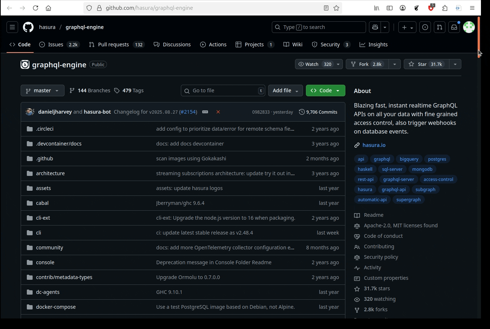

<!--
author:   Andrea Charão

email:    andrea@inf.ufsm.br

version:  0.0.1

language: PT-BR

narrator: Brazilian Portuguese Female

comment:  Material de apoio para a disciplina
          ELC117 - Paradigmas de Programação
          da Universidade Federal de Santa Maria

translation: English  translations/English.md

link:     https://cdn.jsdelivr.net/chartist.js/latest/chartist.min.css

script:   https://cdn.jsdelivr.net/chartist.js/latest/chartist.min.js

link:     https://cdn.jsdelivr.net/gh/AndreaInfUFSM/elc117-2026a@main/assets/css/custom.css


@onload
window.CodeRunner = {
    ws: undefined,
    handler: {},
    connected: false,
    error: "",
    url: "",
    firstConnection: true,

    init(url, step = 0) {
        this.url = url
        if (step  >= 10) {
           console.warn("could not establish connection")
           this.error = "could not establish connection to => " + url
           return
        }

        this.ws = new WebSocket(url);

        const self = this
        
        const connectionTimeout = setTimeout(() => {
          self.ws.close();
          console.log("WebSocket connection timed out");
        }, 5000);
        
        
        this.ws.onopen = function () {
            clearTimeout(connectionTimeout);
            self.log("connections established");

            self.connected = true
            
            setInterval(function() {
                self.ws.send("ping")
            }, 15000);
        }
        this.ws.onmessage = function (e) {
            // e.data contains received string.

            let data
            try {
                data = JSON.parse(e.data)
            } catch (e) {
                self.warn("received message could not be handled =>", e.data)
            }
            if (data) {
                self.handler[data.uid](data)
            }
        }
        this.ws.onclose = function () {
            clearTimeout(connectionTimeout);
            self.connected = false
            self.warn("connection closed ... reconnecting")

            setTimeout(function(){
                console.warn("....", step+1)
                self.init(url, step+1)
            }, 1000)
        }
        this.ws.onerror = function (e) {
            clearTimeout(connectionTimeout);
            self.warn("an error has occurred")
        }
    },
    log(...args) {
        window.console.log("CodeRunner:", ...args)
    },
    warn(...args) {
        window.console.warn("CodeRunner:", ...args)
    },
    handle(uid, callback) {
        this.handler[uid] = callback
    },
    send(uid, message, sender=null, restart=false) {
        const self = this
        if (this.connected) {
          message.uid = uid
          this.ws.send(JSON.stringify(message))
        } else if (this.error) {

          if(restart) {
            sender.lia("LIA: terminal")
            this.error = ""
            this.init(this.url)
            setTimeout(function() {
              self.send(uid, message, sender, false)
            }, 2000)

          } else {
            //sender.lia("LIA: wait")
            setTimeout(() => {
              sender.lia(" " + this.error)
              sender.lia(" Maybe reloading fixes the problem ...")
              sender.lia("LIA: stop")
            }, 800)
          }
        } else {
          setTimeout(function() {
            self.send(uid, message, sender, false)
          }, 2000)
          
          if (sender) {
            
            sender.lia("LIA: terminal")
            if (this.firstConnection) {
              this.firstConnection = false
              setTimeout(() => { 
                sender.log("stream", "", [" Waking up execution server ...\n", "This may take up to 30 seconds ...\n", "Please be patient ...\n"])
              }, 100)
            } else {
              sender.log("stream", "", ".")
            }
            sender.lia("LIA: terminal")
          }
        }
    }
}

//window.CodeRunner.init("wss://coderunner.informatik.tu-freiberg.de/")
//window.CodeRunner.init("ws://localhost:4000/")
window.CodeRunner.init("wss://ancient-hollows-41316.herokuapp.com/")
@end

@LIA.c:                 @LIA.eval(`["main.c"]`, `gcc -Wall main.c -o a.out`, `./a.out`)
@LIA.haskell:           @LIA.eval(`["main.hs"]`, `ghc main.hs -o main`, `./main`)
@LIA.haskell_withShell: @LIA.eval(`["main.hs"]`, `none`, `ghci main.hs`)


@LIA.eval:  @LIA.eval_(false,`@0`,@1,@2,@3)

@LIA.evalWithDebug: @LIA.eval_(true,`@0`,@1,@2,@3)

@LIA.eval_
<script>
function random(len=16) {
    let chars = 'ABCDEFGHIJKLMNOPQRSTUVWXYZabcdefghijklmnopqrstuvwxyz0123456789';
    let str = '';
    for (let i = 0; i < len; i++) {
        str += chars.charAt(Math.floor(Math.random() * chars.length));
    }
    return str;
}


const uid = random()
var order = @1
var files = []

var pattern = "@4".trim()

if (pattern.startsWith("\`")){
  pattern = pattern.slice(1,-1)
} else if (pattern.length === 2 && pattern[0] === "@") {
  pattern = null
}

if (order[0])
  files.push([order[0], `@'input(0)`])
if (order[1])
  files.push([order[1], `@'input(1)`])
if (order[2])
  files.push([order[2], `@'input(2)`])
if (order[3])
  files.push([order[3], `@'input(3)`])
if (order[4])
  files.push([order[4], `@'input(4)`])
if (order[5])
  files.push([order[5], `@'input(5)`])
if (order[6])
  files.push([order[6], `@'input(6)`])
if (order[7])
  files.push([order[7], `@'input(7)`])
if (order[8])
  files.push([order[8], `@'input(8)`])
if (order[9])
  files.push([order[9], `@'input(9)`])


send.handle("input", (e) => {
    CodeRunner.send(uid, {stdin: e}, send)
})
send.handle("stop",  (e) => {
    CodeRunner.send(uid, {stop: true}, send)
});


CodeRunner.handle(uid, function (msg) {
    switch (msg.service) {
        case 'data': {
            if (msg.ok) {
                CodeRunner.send(uid, {compile: @2}, send)
            }
            else {
                send.lia("LIA: stop")
            }
            break;
        }
        case 'compile': {
            if (msg.ok) {
                if (msg.message) {
                    if (msg.problems.length)
                        console.warn(msg.message);
                    else
                        console.log(msg.message);
                }

                send.lia("LIA: terminal")
                CodeRunner.send(uid, {exec: @3, filter: pattern})

                if(!@0) {
                  console.clear()
                }
            } else {
                send.lia(msg.message, msg.problems, false)
                send.lia("LIA: stop")
            }
            break;
        }
        case 'stdout': {
            if (msg.ok)
                console.stream(msg.data)
            else
                console.error(msg.data);
            break;
        }

        case 'stop': {
            if (msg.error) {
                console.error(msg.error);
            }

            if (msg.images) {
                for(let i = 0; i < msg.images.length; i++) {
                    console.html("<hr/>", msg.images[i].file)
                    console.html("")
                }
            }

            if (msg.videos) {
                for(let i = 0; i < msg.videos.length; i++) {
                    console.html("<hr/>", msg.videos[i].file)
                    console.html("<video controls style='width:100%' title='" + msg.videos[i].file + "' src='" + msg.videos[i].data + "'></video>")
                }
            }

            if (msg.files) {
                let str = "<hr/>"
                for(let i = 0; i < msg.files.length; i++) {
                    str += `<a href='data:application/octet-stream${msg.files[i].data}' download="${msg.files[i].file}">${msg.files[i].file}</a> `
                }

                console.html(str)
            }

            window.console.warn(msg)

            send.lia("LIA: stop")
            break;
        }

        default:
            console.log(msg)
            break;
    }
})


CodeRunner.send(
    uid, { "data": files }, send, true
);

"LIA: wait"
</script>
@end

-->

<!--
nvm use v14.21.1
liascript-devserver --input README.md --port 3001 --live
npx -p @liascript/devserver liascript-devserver --test --input ./README.md
https://liascript.github.io/course/?https://raw.githubusercontent.com/AndreaInfUFSM/elc117-2026a/master/classes/08/README.md
-->


[](https://liascript.github.io/course/?https://raw.githubusercontent.com/AndreaInfUFSM/elc117-2026a/main/classes/08/README.md)


# Programação Funcional em Haskell


> Este material faz parte de uma introdução à **programação funcional** em Haskell.
>
> O conteúdo tem partes interativas e pode ser visualizado de vários modos usando as opções no topo da página.


## Programas mais complexos?

> Que tal navegar por repositórios de código aberto que empregam diferentes linguagens?

### Exemplo: Hasura GraphQL Engine

O que é? 

- Solução para construção rápida de backend para sistemas web (geração de API GraphQL para acesso a bancos de dados)
- Clientes: grandes empresas de TI
- Startup "unicórnio" em 2022, com grandes investimentos: https://techcrunch.com/2022/02/22/graphql-developer-platform-hasura-raises-100m-series-c/



#### Código aberto
 

- Um repo: https://github.com/hasura/graphql-engine
- Um arquivo: https://github.com/hasura/graphql-engine/blob/014d362d7cc618c8b864218260eee1b43e6b4e2b/server/src-lib/Hasura/Server/Utils.hs
- Um panorama deste arquivo: 

  - 300+ linhas
  - 70+ linhas de cabeçalho (module / import)
  - restante das linhas contém 30+ definições de funções/tipos
  


#### Conhecido x Desconhecido

Arquivo: https://github.com/hasura/graphql-engine/blob/014d362d7cc618c8b864218260eee1b43e6b4e2b/server/src-lib/Hasura/Server/Utils.hs

**O que você conhece (aulas anteriores)** versus **O que você não conhece**

| Conhecido   | Desconhecido   |
| :--------- | :--------- |
| Funções tipadas; condicionais com if/then/else e guardas; listas e tuplas; lambdas; funções map, filter, snd, fst, elem; operadores ++, ==; import       | Novos tipos, type classes e operadores, let e where, Template Haskell (compile-time metaprogramming), ações / efeitos colaterais desejados (do, return, etc.)    |


> Nesta aula, avançaremos em direção ao desconhecido!


## Uso de `let`

- Sintaxe: `let` .. `in`
- Semelhante a "seja x .. " em matemática: vem **antes** de uma expressão
- Especifica nomes de variáveis / sub-expressões que serão usadas em uma expressão final

``` haskell
func :: Int -> Int -> Int
func a b =
  let x = 3*a
      y = 6*b
   in x + y

main = do
  print (func 1 2) -- 3*1 + 6*2
  -- putStrLn (show (func 1 2))
```
@LIA.haskell

**Atenção** à endentação (indent):

- Usar `let` em uma nova linha, recuada à direita em relação à linha anterior
- Alinhar as expressões dentro do `let` (legibilidade)
- Alinhar `in` e `let` para que expressões se alinhem

### Exemplo: cylinder


Cálculo da área de superfície de um cilindro: 

- Em matemática: https://pt.khanacademy.org/math/geometry/hs-geo-solids/hs-geo-solids-intro/v/cylinder-volume-and-surface-area
- Em Haskell: http://learnyouahaskell.github.io/syntax-in-functions


``` haskell
cylinder :: Float -> Float -> Float  
cylinder r h =
  let sideArea = 2 * pi * r * h  
      topArea = pi * r^2  
   in sideArea + 2 * topArea

-- Função principal
main = do
  print "Raio r:"
  r <- getLine
  print "Altura h:"
  h <- getLine  
  print (cylinder (read r::Float) (read h::Float))
```
@LIA.haskell


### Exemplo: isValidEmail

Validação de String representando email (validação muito simples, apenas para ilustrar uso do `let`):

``` haskell
isValidEmail :: String -> Bool
isValidEmail email =
  let hasAtSymbol = elem '@' email
      hasDomain = elem '.' (dropWhile (/= '@') email)
   in hasAtSymbol && hasDomain

main = do
  print (isValidEmail "andrea@inf.ufsm.br")
```
@LIA.haskell

Observações:

- `hasAtSymbol`: verifica se o caracter `@` faz parte da string que representa o email
- `hasDomain`: verifica se existe um `.` na parte após o caracter `@`
- `dropWhile` é uma função de alta ordem que "descarta" elementos de uma lista enquanto satisfizerem uma condição

  - veja mais sobre esta função aqui: http://zvon.org/other/haskell/Outputprelude/dropWhile_f.html


## Uso de `where`

- Semelhante a "onde x .." em matemática - vem **após** uma expressão
- Especifica nomes de variáveis / sub-expressões que compõem uma expressão final


``` haskell
func :: Int -> Int -> Int
func a b = x + y
  where x = 3*a
        y = 6*b

main = do
  print (func 1 2) -- 3*1 + 6*2
  -- putStrLn (show (func 1 2))        
```
@LIA.haskell

Atenção à endentação (indent):

- Usar `where` em uma nova linha, recuada à direita em relação à linha anterior
- Alinhar as expressões dentro do `where` (legibilidade)


### Exemplo: cylinder


Cálculo da área de superfície de um cilindro: 

- Em matemática: https://pt.khanacademy.org/math/geometry/hs-geo-solids/hs-geo-solids-intro/v/cylinder-volume-and-surface-area
- Em Haskell: http://learnyouahaskell.github.io/syntax-in-functions


``` haskell
cylinder :: Float -> Float -> Float  
cylinder r h = sideArea + 2 * topArea
  where sideArea = 2 * pi * r * h  
        topArea = pi * r^2     

-- Função principal
main = do
  print "Raio r:"
  r <- getLine
  print "Altura h:"
  h <- getLine  
  print (cylinder (read r::Float) (read h::Float))
```
@LIA.haskell

### Exemplo: isValidEmail

Validação de String representando email (validação muito simples, apenas para ilustrar uso do `where`)::

``` haskell
isValidEmail :: String -> Bool
isValidEmail email = hasAtSymbol && hasDomain
  where hasAtSymbol = elem '@' email
        hasDomain = elem '.' (dropWhile (/= '@') email)

main = do
  print (isValidEmail "andrea@inf.ufsm.br")
```
@LIA.haskell


## Exemplo: Validação de CPF

> Você sabe como calcular dígitos verificadores de um CPF?

Cadastro de Pessoas Físicas (CPF)

- 11 dígitos
- 2 dígitos finais verificadores, calculados a partir dos anteriores
- Exemplo: 222.333.444-05
- Validação completa inclui outras verificações que não nos interessam aqui


### Primeiro dígito


![Imagem de uma tabela com 3 linhas e 10 colunas, com o objetivo de ilustrar o processo de cálculo do primeiro dígito verificador de um CPF. Na primeira linha, temos o texto "Dígitos CPF" seguido de 9 dígitos, um em cada coluna, referentes a um CPF fictício: 222333444. Na segunda linha, temos o texto "Multiplicadores" seguido dos valores multiplicadores de cada dígito, conforme o algoritmo de cálculo do CPF utilizado pela Receita Federal. Esses valores são: 10,9,8,7,6,5,4,3,2. Na terceira linha, temos o texto "Resultado" seguido dos resultados das multiplicações de cada dígito do CPF de exemplo pelos valores multiplicadores. O restante do procedimento é descrito textualmente, não aparece na imagem.](img/cpfdv1.png)

Procedimento:

1. Multiplicar cada um dos 9 primeiros dígitos por um valor multiplicador correspondente, iniciando em 10 ([10,9..2])
2. Calcular o somatório das multiplicações 

   - Neste exemplo: `2*10 + 2*9 + 2*8 + 3*7 + 3*6 + 3*5 + 4*4 + 4*3 + 4*2` = 
   - `20+18+16+21+18+15+16+12+8` = 144

3. Calcular resto da divisão do somatório por 11 

   - Neste exemplo: `144 % 11` = 1
4. Ajustar o dígito aplicando esta condição:  `DV1 = if DV1 < 2 then 0 else 11-DV1`

   - Neste exemplo, DV1 será 0


### Segundo dígito


![Imagem de uma tabela semelhante à do slide anterior, com uma coluna a mais, para ilustranr o processo de cálculo do segundo dígito verificador. A primeira linha contém os dígitos do CPF, sendo que na última coluna foi acrescido o dígito verificador calculado anteriormente, que no caso era "0". Na segunda linha, que contém os multiplicadores, os valores agora iniciam em 11 e não mais em 10,  ou seja, os multiplicadores serão 11, 10 .. 2. Na terceira linha, temos os resultados das multiplicações. O restante do procedimento é novamente descrito textualmente.](img/cpfdv2.png)

Procedimento:

1. Multiplicar cada um dos 10 primeiros dígitos (incluindo o primeiro verificador) por um valor multiplicador correspondente, iniciando em 11 ([11,10..2])
2. Calcular o somatório das multiplicações. 

   - Neste exemplo: `2*11 + 2*10 + 2*9 + 3*8 + 3*7 + 3*6 + 4*5 + 4*4 + 4*3 + 0*2` = 
   - `22+20+18+24+21+18+20+16+12+8+0` = 171   
3. Calcular resto da divisão do somatório por 11 

   - Neste exemplo: `171 % 11` = 6
4. Ajustar o dígito aplicando esta condição:  `DV2 = if DV2 < 2 then 0 else 11-DV2`. 

   - Neste exemplo, DV2 será 5


### Em C procedimental

- A validação de CPF é um bom exercício de programação
- Uma busca rápida no Google sempre traz muitos resultados
- Busque por: [validação cpf em c](https://www.google.com/search?q=validacao+cpf+em+c)
- Um resultado: http://acesso.materdei.edu.br/omero/C/Exercicios/B/B8.Htm (link desativado)

``` c
// Desenvolva um programa que aceita e valida o CPF- Cadastro de Pessoa Física.
// Copyright Prof. Omero Francisco Bertol, M.Sc.

#include "stdio.h"
#include "stdlib.h"

void main() {
  int sm, i, r, num;
  char dig10, dig11, cpf[11];
  printf("Informe o valor do CPF:\n");
  gets(cpf);

// calcula o 1o. digito verificador do CPF
  sm = 0;
  for (i=0; i<9; i++) {
    num = cpf[i] - 48;	// transforma o caracter '0' no inteiro 0
			// (48 eh a posição de '0' na tabela ASCII)
    sm = sm + (num * (10 - i));  
  }
  r = 11 - (sm % 11);
  if ((r == 10) || (r == 11))
     dig10 = '0';
  else
     dig10 = r + 48;

// calcula o 2o. digito verificador do CPF
  sm = 0;
  for (i=0; i<10; i++) {
    num = cpf[i] - 48;
    sm = sm + (num * (11 - i));
  }
  r = 11 - (sm % 11);  
  if ((r == 10) || (r == 11))
     dig11 = '0';
  else
     dig11 = r + 48;

// compara os dígitos calculados com os dígitos informados
  if ((dig10 == cpf[9]) && (dig11 == cpf[10]))
     printf("\nO CPF informado eh válido.");
  else
     printf("\nO CPF informado eh inválido.");
}
```
@LIA.c

### Em Haskell funcional

- Na programação funcional, vamos **decompor o problema em funções existentes**

- Vamos evitar código redundante como na versão em C (trechos muito semelhantes para o 1o e o 2o dígitos)

#### Decomposição

- cálculo de cada um dos dígitos é semelhante, portanto ficará numa função
- lista de dígitos será usada para representar um CPF
- somatório: função `sum`
- resto de divisão: função `mod`
- condicionais: `if-then-else`
- partes da lista: função `take`, operador `!!`
- junção de listas: operador `++`
- aplicação de multiplicadores: função `zipWith`
- sub-expressões: `where` e/ou `let..in`


#### Código


``` haskell
import Data.Char

cpfValid :: [Int] -> Bool
cpfValid cpf =
  let digits = take 9 cpf
      dv1 = cpfDV digits [10,9..]
      dv2 = cpfDV (digits ++ [dv1]) [11,10..]
   in dv1 == cpf !! 9 && dv2 == cpf !! 10

cpfDV :: [Int] -> [Int] -> Int
cpfDV digits mults = if res < 2 then 0 else 11-res
  where res = (sum $ zipWith (*) digits mults) `mod` 11

main :: IO()
main = do
 putStrLn "Digite o CPF: "
 cpf <- getLine
 let digits = (map digitToInt cpf)
 putStrLn (if cpfValid digits then "Válido" else "Inválido")
```
@LIA.haskell


## Quizzes

1. Sabendo que a função `take` obtém os `n` primeiros elementos de uma lista, e que `take 2 [1,2,3]` resulta em `[1,2]`, qual será o resultado de:

   `take 3 "Mr. Beast"`?

   [["Mr."]]

2. A função `sum` obtém o somatório de elementos de uma lista, de modo que `sum [1,2,3]` resulta em `6`. Outra forma de calcular este somatório seria: 

   - [( )] `map (+) [1,2,3]`
   - [(x)] `foldl1 (+) [1,2,3]`

3. Qual será o resultado da função abaixo aplicada ao argumento `3`?

   ``` haskell
   func :: Int -> Int
   func n = 
     let a = n + 1
         b = n * 2
      in sum [n, a, b]
   ```

   [[13]]

4. O operador `++` pode ser usado desta forma: `"abc" ++ 'd'` ?

   - [( )] Sim
   - [(x)] Não
   ******************************

   Não pode porque `++` concatena listas, mas o segundo argumento não é uma lista de Char (como "abc") e sim um único Char. Uma forma de resolver isso seria: `"abc" ++ "d"` ou também `"abc" ++ ['d']`.

   ******************************

5. O operador `!!` serve para obter um elemento em uma dada posição de uma lista. Assim, por exemplo: `"abc" !! 0` resultará `'a'`. Sabendo disso, a operação `[7,8,9] !! 2` terá o mesmo resultado que:

   - [( )] `head [7,8,9]`
   - [(x)] `last [7,8,9]`
   - [( )] `tail [7,8,9]`   


## Prática para entregar

- Faça login no GitHub

- Acesse https://github.com/codespaces para localizar o Codespace das práticas OU acesse seu repositório `https://github.com/elc117/haskell01-2026a-<username>`

- Crie uma pasta `haskell03` e copie este arquivo para dentro da pasta:

  - [PointsOfInterest.hs](src/PointsOfInterest.hs)
  

- Você deverá completar as 3 questões no arquivo [PointsOfInterest.hs](src/PointsOfInterest.hs). A compreensão do código faz parte do exercício.

- Para testar o program [PointsOfInterest.hs](src/PointsOfInterest.hs) no GHCi:

  ```
  cd haskell03
  ghci PointsOfInterest.hs
  ```

- É normal que sua solução não funcione da primeira vez. Para resolver problemas, você pode criar outro código menor e fazer pequenos testes da solução no GHCi.


- Faça commit+push para enviar os exercícios para seu repositório


## Bibliografia


- Consulte as seções abaixo no livro [Learn you a Haskell for Great Good!](https://learnyouahaskell.github.io/), de Miran Lipovača:

  - [Where](https://learnyouahaskell.github.io/syntax-in-functions.html#where) (procure por "Where!?")
  - [Let](https://learnyouahaskell.github.io/syntax-in-functions.html#let-it-be) (procure por "Let it be")

- Let vs Where: https://wiki.haskell.org/Let_vs._Where

- Índice de funções Haskell em Zvon.org: http://zvon.org/other/haskell/Outputglobal/index.html (este site alerta que está obsoleto e por isso alguns exemplos podem não funcionar, mas para muitas funções simples, os exemplos ainda continuam válidos)

